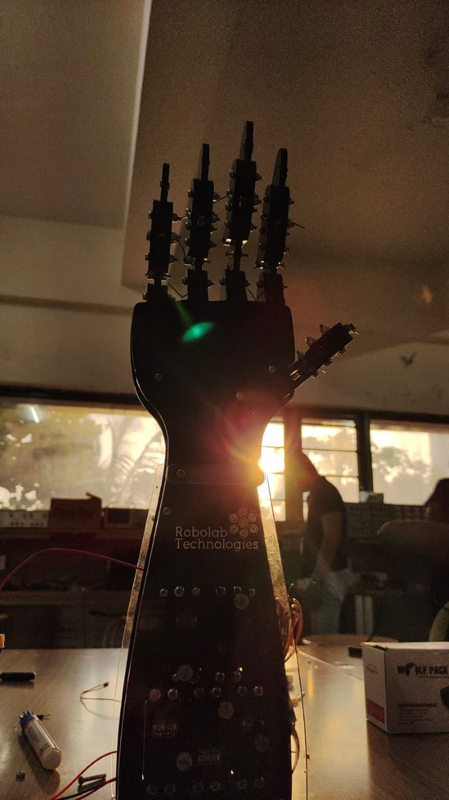

# Bionic Arm 

## Project Overview
The project aims to develop a real-time hand gesture recognition system that detects and tracks hand movements using Mediapipe and Opencv and communicates the recognized gestures to an Arduino for further actions. This project demonstrates the integration of computer vision for gesture recognition with hardware control based on hand gestures.

## Instructions
1. Before running the script ,install the required libraries through by running the following commands in the terminal :
->pip install opencv-python
->pip install mediapipe
->pip install Pyserial

2. Create a new python script and copy the python code into it . using the GitHub repository link :https://github.com/roboclubmvjce/Bionic_Arm/raw/main/Degree_Hand_Tracker.py

3. Connect your computer to the Arduino via USB.

4. Run the python script

